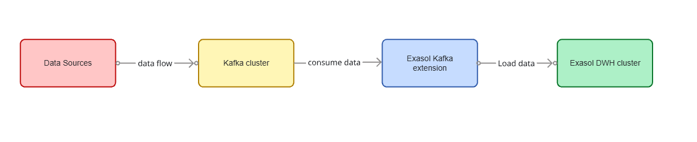

===========================
Kafka Connector Extension
===========================

.. toctree::
   :maxdepth: 2

  

Overview
=========

Exasol Kafka Connector Extension allows you to connect to Apache Kafka and import Apache Avro, JSON or String formatted data from Kafka topics.
Using the connector you can import data from a Kafka topic into an Exasol table.

Pre-requisites
================

* Runing Exasol cluster of version 6.0 or later.
* Running Kafka cluster with version 2.0.0 or later (We recommend a JVM based Docker Image).
* If you use the Confluent Kafka distribution, it should have the version 5.0.0 or later.

.. code-block::
    :caption: Run this command for the docker kafka container

    docker run -p 9092:9092 apache/kafka:4.1.1

* If you use the Confluent Kafka distribution, it should have the version 5.0.0 or later.

Deployment
===========

This section describes how to deploy and prepare the user-defined functions (UDFs) for Kafka integration.

Download the Latest JAR File
------------------------------

Please download and save the latest assembled (with all dependencies included) jar file from the `Github Releases <https://github.com/exasol/kafka-connector-extension/releases>`_.

Upload the JAR File to BucketFS
---------------------------------

Upload the jar file using the curl command. A folder in the :ref:`bucket-fs` will automatically be created with the given name e.g. /jars

.. code-block::
   
    curl -X PUT -T exasol-kafka-connector-extension-1.7.16.jar http://w:<WRITE_PASSWORD>@<EXASOL_DATANODE>:2580/jars/

Ensure that the file was uploaded. Check the contents of the bucket.

.. code-block::

    curl -X GET http://r:<READ_PASSWORD>@<EXASOL_DATANODE>:2580/jars/

Create UDF Scripts
-------------------

First, create a schema that will contain the :ref:`udf` scripts.

.. code-block::

    CREATE SCHEMA KAFKA_EXTENSION;

Run the following commands and make sure to check and change the version number and the bucket name before executing.
**Please do not change the UDF script names.**

.. code-block::

    OPEN SCHEMA KAFKA_EXTENSION;
    CREATE OR REPLACE JAVA SET SCRIPT KAFKA_CONSUMER(...) EMITS (...) AS
    %scriptclass com.exasol.cloudetl.kafka.KafkaConsumerQueryGenerator;
    %jar /buckets/bfsdefault/<BUCKET>/exasol-kafka-connector-extension-1.7.16.jar;
    /

    CREATE OR REPLACE JAVA SET SCRIPT KAFKA_IMPORT(...) EMITS (...) AS
    %scriptclass com.exasol.cloudetl.kafka.KafkaTopicDataImporter;
    %jar /buckets/bfsdefault/<BUCKET>/exasol-kafka-connector-extension-1.7.16.jar;
    /

    CREATE OR REPLACE JAVA SET SCRIPT KAFKA_METADATA(
    params VARCHAR(2000),
    kafka_partition DECIMAL(18, 0),
    kafka_offset DECIMAL(36, 0)
    )
    EMITS (partition_index DECIMAL(18, 0), max_offset DECIMAL(36,0)) AS
    %scriptclass com.exasol.cloudetl.kafka.KafkaTopicMetadataReader;
    %jar /buckets/bfsdefault/<BUCKET>/exasol-kafka-connector-extension-1.7.16.jar;
    /

Supported Kafka Record Formats
-----------------------------------

* Avro
* JSON
* String

The format of the records can be set for both key and value with the following configuration values:

.. code-block::

    RECORD_KEY_FORMAT=avro|json|string

.. code-block::

    RECORD_VALUE_FORMAT=avro|json|string

It should match the format of the records on the topic you are importing. The connector can extract fields from the key and value of the records and insert them into the target table the import is running against.
The configuration setting RECORD_FIELDS controls the list of values which are inserted into the table.

**Please note that when using Avro format, you are required to provide Confluent Schema Registry URL address.**

The following table illustrates the possible values and support for the serialization formats.

.. list-table::
   :header-rows: 1
   :widths: 28 36 12 18 6

   * - Record Field Specification
     - Value
     - Avro
     - JSON
     - String
   * - ``value._field1_``
     - The field *field1* of the record value
     - yes
     - yes
     - no
   * - ``key._field2_``
     - The field *field2* of the record key
     - yes
     - yes
     - no
   * - ``value.*``
     - All fields from the record value
     - yes
     - no (order not deterministic)
     - no
   * - ``key.*``
     - All fields from the record key
     - yes
     - no (order not deterministic)
     - no
   * - ``value``
     - The record value as string
     - yes (as JSON)
     - yes (as JSON)
     - yes
   * - ``key``
     - The record key as string
     - yes (as JSON)
     - yes (as JSON)
     - yes
   * - ``timestamp``
     - The record timestamp
     - yes
     - yes
     - yes

Example
--------

Given a record that has the following Avro value (JSON representation)

.. code::

        {
    "firstName": "John",
    "lastName": "Smith",
    "isAlive": true,
    "age": 27
        }

and this key (also Avro, as JSON representation)

.. code::

        {
    "id": 123
        }

Then you can configure the connector with parameters as shown below:

.. code::

    RECORD_KEY_FORMAT=avro
    RECORD_VALUE_FORMAT=avro
    RECORD_FIELDS=key.id,timestamp,value.lastName,value.age

This imports field from the record key, the fields lastName and age from value and the record timestamp metadata.

Preparing Exasol table
-----------------------

You should create a corresponding table in Exasol that stores the data from a Kafka topic.

The table column names and types should match the fields specified in the RECORD_FIELDS parameter. Please make sure the number of columns and their order is correct — otherwise the import will lead to an error as there is no by-name mapping possible.

Additionally, add two extra columns to the end of the table. These columns store the Kafka metadata and help to keep track of the already imported records.

For example, given the following Avro record schema,

.. code::

        {
    "type": "record",
    "name": "KafkaExasolAvroRecord",
    "fields": [
        { "name": "product", "type": "string" },
        { "name": "price", "type": { "type": "bytes", "precision": 4, "scale": 2, "logicalType": "decimal" }},
        { "name": "sale_time", "type": { "type": "long", "logicalType": "timestamp-millis" }}
    ]
    }

and the setting

.. code::

    RECORD_FIELDS=value.product,value.price,value.sale_time

then, you should define the following Exasol table with column types mapped respectively

.. code::

    CREATE OR REPLACE TABLE <schema_name>.<table_name> (
    PRODUCT     VARCHAR(500),
    PRICE       DECIMAL(4, 2),
    SALE_TIME   TIMESTAMP,

    KAFKA_PARTITION DECIMAL(18, 0),
    KAFKA_OFFSET DECIMAL(36, 0)
    );

The last two columns are used to store the metadata about Kafka topic partition and record offset inside a partition:

To see Data Mappings, check the `link <https://github.com/exasol/kafka-connector-extension/blob/main/doc/user_guide/user_guide.md#avro-data-mapping>`_

Please notice that we convert Avro complex types to the JSON Strings. Use Exasol ``VARCHAR(n)`` column type to store them. Depending on the size of complex type, set the number of characters in the VARCHAR type accordingly.

Importing Records
------------------

The import command has the following form:

.. code::

    IMPORT INTO <schema_name>.<table_name>
    FROM SCRIPT KAFKA_CONSUMER WITH
    BOOTSTRAP_SERVERS   = '<kafka_bootstap_servers>'
    SCHEMA_REGISTRY_URL = '<schema_registry_url>'
    TOPIC_NAME          = '<kafka_topic>
    TABLE_NAME          = '<schema_name>.<table_name>'
    GROUP_ID            = 'exasol-kafka-udf-consumers';

For example, given the Kafka topic named SALES-POSITIONS containing Avro encoded values, we can import its data into RETAIL.SALES_POSITIONS table in Exasol:

.. code::

    IMPORT INTO RETAIL.SALES_POSITIONS
    FROM SCRIPT KAFKA_CONSUMER WITH
    BOOTSTRAP_SERVERS   = 'kafka01.internal:9092,kafka02.internal:9093,kafka03.internal:9094'
    SCHEMA_REGISTRY_URL = 'http://schema-registry.internal:8081'
    TOPIC_NAME          = 'SALES-POSITIONS'
    TABLE_NAME          = 'RETAIL.SALES_POSITIONS'
    GROUP_ID            = 'exasol-kafka-udf-consumers';

**Congratulations! You can now import Kafka topics into an Exasol table using the Kafka connector. Enjoy!**

Extra features
------------------

Check out extra features of Exasol's Kafka connector like `Import with Authentication <https://github.com/exasol/kafka-connector-extension/blob/main/doc/user_guide/user_guide.md#import-kafka-topic-data-with-authentication>`_ , `Import using Encrypted Connection <https://github.com/exasol/kafka-connector-extension/blob/main/doc/user_guide/user_guide.md#import-kafka-topic-data-using-encrypted-connection>`_ or `Importing data from Azure Event Hubs <https://github.com/exasol/kafka-connector-extension/blob/main/doc/user_guide/user_guide.md#import-kafka-topic-data-using-encrypted-connection>`_ 

Kafka Consumer Properties
--------------------------

See the `Kafka Consumer Properties <https://github.com/exasol/kafka-connector-extension/blob/main/doc/user_guide/user_guide.md#kafka-consumer-properties>`_ to find out more.