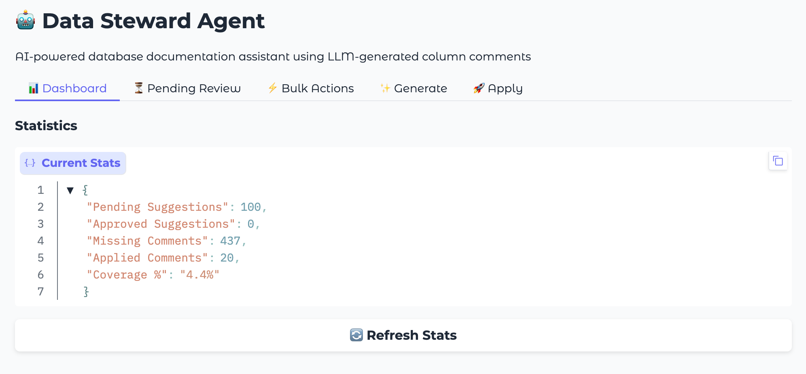

===================
Data Steward Agent
===================

Overview
========

Learn how to automatically generate and manage column comments in your Exasol database using AI. This tutorial demonstrates a Data Steward Agent that analyzes column names, data types, and sample values to suggest meaningful documentation using local LLMs (Ollama).

Why Automate Metadata Documentation?
------------------------------------

Database metadata is critical for data discovery, governance, and effective data usage. However, many databases lack proper documentation, especially:

* Inherited databases from previous teams
* Post-migration scenarios where metadata was lost
* Rapidly evolving schemas where documentation falls behind

**Benefits of AI-Assisted Documentation:**

**Time Savings**
   * Automate tedious documentation tasks
   * Process hundreds of columns in minutes
   * Focus human effort on review rather than drafting

**Consistency**
   * Uniform comment style across all schemas
   * Professional, concise descriptions
   * No more cryptic abbreviations left unexplained

**AI-Ready Data**
   * Rich metadata enables AI-driven analytics
   * Semantic context for LLM-powered queries
   * Foundation for natural language data exploration

**Self-Hosted & Secure**
   * Data never leaves your infrastructure
   * No third-party API calls
   * Full compliance control

Architecture
============

.. code-block:: text

                    ┌─────────────────┐      HTTP Request     ┌─────────────────┐
                    │   Exasol DB     │ ────────────────────> │ Mistral model   │
   Column   <─────  │  (UDF + Views)  │      (Python UDF)     │   (Ollama)      │
   Comments   SQL   │                 │ <──────────────────── │                 │
                    └─────────────────┘       JSON Response   └─────────────────┘

The agent workflow:

1. **Identify** - Query system catalog for columns without comments
2. **Analyze** - Gather column metadata and sample values
3. **Generate** - Call Ollama to suggest descriptions
4. **Review** - Human approval of suggestions
5. **Apply** - Write approved comments to database

Prerequisites
=============

**Required:**

* Exasol database (Docker image works for testing)
* Ollama installed locally with Mistral model
* Python 3.8+ with pyexasol
* Basic SQL knowledge

**Ollama Setup:**

.. code-block:: bash

   # Install Ollama (macOS)
   brew install ollama

   # Start server and download model
   ollama serve &
   ollama pull mistral

Create Agent Infrastructure
============================

Create a dedicated schema for the Data Steward Agent with tables to track suggestions and their status.

Schema and Tables
-----------------

.. code-block:: sql

   -- Create DATA_STEWARD schema
   CREATE SCHEMA IF NOT EXISTS DATA_STEWARD;

   -- SUGGESTIONS table stores LLM-generated column comment suggestions
   CREATE TABLE IF NOT EXISTS DATA_STEWARD.SUGGESTIONS (
       ID INTEGER IDENTITY PRIMARY KEY,
       SCHEMA_NAME VARCHAR(128) NOT NULL,
       TABLE_NAME VARCHAR(128) NOT NULL,
       COLUMN_NAME VARCHAR(128) NOT NULL,
       SUGGESTED_COMMENT VARCHAR(2000),
       STATUS VARCHAR(20) DEFAULT 'PENDING',
       CREATED_AT TIMESTAMP DEFAULT CURRENT_TIMESTAMP,
       UPDATED_AT TIMESTAMP DEFAULT CURRENT_TIMESTAMP
   );

   -- APPLIED_LOG tracks which comments have been applied
   CREATE TABLE IF NOT EXISTS DATA_STEWARD.APPLIED_LOG (
       ID INTEGER IDENTITY PRIMARY KEY,
       SUGGESTION_ID INTEGER NOT NULL,
       APPLIED_AT TIMESTAMP DEFAULT CURRENT_TIMESTAMP,
       APPLIED_BY VARCHAR(128) DEFAULT CURRENT_USER,
       SCHEMA_NAME VARCHAR(128),
       TABLE_NAME VARCHAR(128),
       COLUMN_NAME VARCHAR(128),
       COMMENT_TEXT VARCHAR(2000)
   );

Views
-----

.. code-block:: sql

   -- View to identify columns missing comments
   CREATE OR REPLACE VIEW DATA_STEWARD.MISSING_METADATA AS
   SELECT
       COLUMN_SCHEMA,
       COLUMN_TABLE,
       COLUMN_NAME,
       COLUMN_TYPE,
       COLUMN_IS_NULLABLE
   FROM
       SYS.EXA_ALL_COLUMNS
   WHERE
       COLUMN_COMMENT IS NULL
       AND COLUMN_SCHEMA NOT IN ('SYS', 'EXA_STATISTICS', 'DATA_STEWARD')
   ORDER BY
       COLUMN_SCHEMA,
       COLUMN_TABLE,
       COLUMN_ORDINAL_POSITION;

   -- Helper view: formatted column list per table
   CREATE OR REPLACE VIEW DATA_STEWARD.TABLE_COLUMNS_FORMATTED AS
   SELECT
       COLUMN_SCHEMA,
       COLUMN_TABLE,
       GROUP_CONCAT(
           COLUMN_NAME || ' (' || COLUMN_TYPE || ')'
           ORDER BY COLUMN_ORDINAL_POSITION
           SEPARATOR ', '
       ) AS COLUMN_LIST
   FROM SYS.EXA_ALL_COLUMNS
   WHERE COLUMN_SCHEMA NOT IN ('SYS', 'EXA_STATISTICS', 'DATA_STEWARD')
   GROUP BY COLUMN_SCHEMA, COLUMN_TABLE;

Ollama Connection
-----------------

Store the Ollama endpoint in a connection object for reusability:

.. code-block:: sql

   -- Replace localhost with your machine's IP if Exasol runs in Docker
   CREATE OR REPLACE CONNECTION OLLAMA_API
   TO 'http://YOUR_IP:11434/api/generate'
   IDENTIFIED BY '';

.. note::
   If Exasol runs in Docker, use your machine's local IP (e.g., ``10.0.0.186``)
   instead of ``localhost``. Find it with ``ipconfig getifaddr en0`` (macOS)
   or ``hostname -I`` (Linux).

AI-Powered UDF
===============

This UDF calls Ollama to generate column comment suggestions based on metadata and sample values.

.. code-block:: text

   CREATE OR REPLACE PYTHON3 SCALAR SCRIPT DATA_STEWARD.SUGGEST_COLUMN_COMMENT(
       connection_name VARCHAR(200),
       schema_name VARCHAR(128),
       table_name VARCHAR(128),
       column_name VARCHAR(128),
       data_type VARCHAR(100),
       sample_values VARCHAR(2000),
       table_columns VARCHAR(4000)
   )
   RETURNS VARCHAR(2000) AS

   import requests
   import json

   def run(ctx):
       try:
           conn_info = exa.get_connection(ctx.connection_name)
           ollama_url = conn_info.address

           prompt = f"""You are a database documentation expert. Generate a concise, informative comment for this database column.

   Schema: {ctx.schema_name}
   Table: {ctx.table_name}
   Column: {ctx.column_name}
   Data Type: {ctx.data_type}
   Sample Values: {ctx.sample_values if ctx.sample_values else 'No samples'}
   Table Columns: {ctx.table_columns if ctx.table_columns else 'Not provided'}

   Provide ONLY the comment text (max 200 characters). Be specific, professional, and concise."""

           payload = {
               'model': 'mistral',
               'prompt': prompt,
               'stream': False,
               'options': {'temperature': 0.3, 'num_predict': 100}
           }

           response = requests.post(ollama_url, json=payload, timeout=30)
           response.raise_for_status()

           comment = response.json().get('response', '').strip()
           comment = comment.replace('"', '').replace("'", '').strip()

           return comment[:200] if len(comment) > 200 else comment

       except Exception as e:
           return f"Error: {str(e)[:100]}"
   /

Workflow
========

Identify Missing Metadata
-------------------------

Query the view to see which columns need documentation:

.. code-block:: sql

   -- See columns missing comments
   SELECT
       COLUMN_SCHEMA,
       COLUMN_TABLE,
       COLUMN_NAME,
       COLUMN_TYPE
   FROM DATA_STEWARD.MISSING_METADATA
   WHERE COLUMN_SCHEMA IN ('SALES', 'HR')  -- Your target schemas
   LIMIT 20;

   -- Count by schema
   SELECT
       COLUMN_SCHEMA,
       COUNT(*) as missing_comments
   FROM DATA_STEWARD.MISSING_METADATA
   GROUP BY COLUMN_SCHEMA
   ORDER BY missing_comments DESC;

Generate Suggestions
--------------------

Call the UDF to generate comment suggestions for columns. The example below processes columns one at a time to include real sample values:

.. code-block:: sql

   -- Test the UDF on a single column
   SELECT DATA_STEWARD.SUGGEST_COLUMN_COMMENT(
       'OLLAMA_API',
       'SALES',
       'ORDERS',
       'ord_dt',
       'DATE',
       '2024-01-15, 2024-02-20, 2024-03-10',
       'ord_id (INTEGER), cust_id (INTEGER), ord_dt (DATE), tot_amt (DECIMAL)'
   );

For batch processing, use Python with pyexasol to fetch sample values dynamically:

.. code-block:: python

   import pyexasol

   conn = pyexasol.connect(dsn="localhost:8563", user="sys", password="exasol")

   # Get columns to process
   columns = conn.execute("""
       SELECT m.COLUMN_SCHEMA, m.COLUMN_TABLE, m.COLUMN_NAME,
              m.COLUMN_TYPE, tc.COLUMN_LIST
       FROM DATA_STEWARD.MISSING_METADATA m
       JOIN DATA_STEWARD.TABLE_COLUMNS_FORMATTED tc
         ON m.COLUMN_SCHEMA = tc.COLUMN_SCHEMA
        AND m.COLUMN_TABLE = tc.COLUMN_TABLE
       WHERE m.COLUMN_SCHEMA = 'SALES'
       LIMIT 10
   """).fetchall()

   for schema, table, column, dtype, col_list in columns:
       # Fetch sample values
       samples = conn.execute(f'''
           SELECT DISTINCT "{column}"
           FROM {schema}.{table}
           WHERE "{column}" IS NOT NULL
           LIMIT 5
       ''').fetchall()
       sample_str = ', '.join([str(s[0]) for s in samples])[:500]

       # Generate and store suggestion
       conn.execute(f"""
           INSERT INTO DATA_STEWARD.SUGGESTIONS
               (SCHEMA_NAME, TABLE_NAME, COLUMN_NAME, SUGGESTED_COMMENT, STATUS)
           SELECT
               '{schema}', '{table}', '{column}',
               DATA_STEWARD.SUGGEST_COLUMN_COMMENT(
                   'OLLAMA_API', '{schema}', '{table}', '{column}', '{dtype}',
                   '{sample_str.replace("'", "''")}',
                   '{col_list.replace("'", "''")[:2000]}'
               ),
               'PENDING'
       """)
       print(f"Generated: {schema}.{table}.{column}")

   conn.commit()

Review Suggestions
------------------

Examine the generated suggestions before approving:

.. code-block:: sql

   SELECT
       ID,
       SCHEMA_NAME,
       TABLE_NAME,
       COLUMN_NAME,
       SUGGESTED_COMMENT,
       STATUS
   FROM DATA_STEWARD.SUGGESTIONS
   WHERE STATUS = 'PENDING'
   ORDER BY SCHEMA_NAME, TABLE_NAME, ID;

Approve Suggestions
-------------------

Mark suggestions as approved after review:

.. code-block:: sql

   -- Approve all pending suggestions
   UPDATE DATA_STEWARD.SUGGESTIONS
   SET STATUS = 'APPROVED', UPDATED_AT = CURRENT_TIMESTAMP
   WHERE STATUS = 'PENDING';

   -- Or approve specific suggestions by ID
   UPDATE DATA_STEWARD.SUGGESTIONS
   SET STATUS = 'APPROVED', UPDATED_AT = CURRENT_TIMESTAMP
   WHERE ID IN (1, 2, 3);

   -- Reject a suggestion
   UPDATE DATA_STEWARD.SUGGESTIONS
   SET STATUS = 'REJECTED', UPDATED_AT = CURRENT_TIMESTAMP
   WHERE ID = 4;

Apply to Database
-----------------

Generate and execute COMMENT statements for approved suggestions:

.. code-block:: sql

   -- Preview the statements
   SELECT
       'COMMENT ON COLUMN ' || SCHEMA_NAME || '.' || TABLE_NAME || '.' ||
       COLUMN_NAME || ' IS ''' || REPLACE(SUGGESTED_COMMENT, '''', '''''') ||
       ''';' as sql_statement
   FROM DATA_STEWARD.SUGGESTIONS
   WHERE STATUS = 'APPROVED';

Apply using Python:

.. code-block:: python

   result = conn.execute("""
       SELECT ID, SCHEMA_NAME, TABLE_NAME, COLUMN_NAME, SUGGESTED_COMMENT
       FROM DATA_STEWARD.SUGGESTIONS
       WHERE STATUS = 'APPROVED'
   """).fetchall()

   for suggestion_id, schema, table, column, comment in result:
       safe_comment = comment.replace("'", "''")

       # Apply the comment
       conn.execute(f"COMMENT ON COLUMN {schema}.{table}.{column} IS '{safe_comment}'")

       # Log and update status
       conn.execute(f"""
           INSERT INTO DATA_STEWARD.APPLIED_LOG
           (SUGGESTION_ID, SCHEMA_NAME, TABLE_NAME, COLUMN_NAME, COMMENT_TEXT)
           VALUES ({suggestion_id}, '{schema}', '{table}', '{column}', '{safe_comment}')
       """)
       conn.execute(f"""
           UPDATE DATA_STEWARD.SUGGESTIONS
           SET STATUS = 'APPLIED', UPDATED_AT = CURRENT_TIMESTAMP
           WHERE ID = {suggestion_id}
       """)

   conn.commit()

Verify Results
--------------

Confirm comments were applied successfully:

.. code-block:: sql

   -- Check applied comments in system catalog
   SELECT
       COLUMN_SCHEMA,
       COLUMN_TABLE,
       COLUMN_NAME,
       COLUMN_COMMENT
   FROM SYS.EXA_ALL_COLUMNS
   WHERE COLUMN_SCHEMA = 'SALES'
     AND COLUMN_COMMENT IS NOT NULL;

   -- View application log
   SELECT * FROM DATA_STEWARD.APPLIED_LOG
   ORDER BY APPLIED_AT DESC
   LIMIT 10;

Web UI with Gradio
==================

For a more interactive experience, the Data Steward Agent includes a Gradio-based web interface that provides a visual dashboard for managing metadata suggestions.

The web UI offers:

**Dashboard Tab**
   * Real-time statistics on documentation coverage
   * Progress tracking across schemas
   * Visual indicators for pending, approved, and applied suggestions

**Generate Tab**
   * Select target schemas from a dropdown
   * One-click suggestion generation
   * Progress feedback during processing

**Review Tab**
   * Browse pending suggestions in a table view
   * Approve, reject, or edit individual suggestions
   * Bulk approve/reject actions for efficiency

**Apply Tab**
   * Preview SQL statements before execution
   * Apply all approved comments with one click
   * View application history and logs

Running the Web UI
------------------

.. code-block:: bash

   # Clone the repository
   git clone https://github.com/exasol-labs/metadata-agent.git
   cd metadata-agent

   # Set up environment
   python3 -m venv venv
   source venv/bin/activate
   pip install -r requirements.txt

   # Configure database connection
   export EXASOL_DSN="your-host:8563"
   export EXASOL_USER="your-user"
   export EXASOL_PASSWORD="your-password"

   # Start the web interface
   python src/app.py

Access the UI at http://localhost:7860

Scheduled Automation
====================

Run the agent automatically to continuously document new columns.

Workflow Modes
--------------

.. list-table::
   :header-rows: 1
   :widths: 25 75

   * - Mode
     - Behavior
   * - **Conservative** (default)
     - Generate PENDING suggestions, apply previously APPROVED
   * - **Automated**
     - Generate, auto-approve passing quality checks, apply
   * - **Generate only**
     - Only generate suggestions for manual review
   * - **Apply only**
     - Only apply previously approved suggestions

Cron Setup
----------

.. code-block:: bash

   # Add to crontab for daily 2 AM runs
   crontab -e

   # Add this line
   0 2 * * * cd /path/to/metadata-agent && python src/scheduled_run.py >> logs/scheduled.log 2>&1

Resources
=========

**Documentation:**

* `Exasol UDF Documentation <https://docs.exasol.com/db/latest/database_concepts/udf_scripts.htm>`_
* `Ollama GitHub <https://github.com/ollama/ollama>`_
* `Exasol Docker Image <https://github.com/exasol/docker-db>`_

**Source Code:**

* `Data Steward Agent Repository <https://github.com/exasol-labs/metadata-agent>`_

Feedback
========

* Contact us on the `Exasol Community <https://community.exasol.com/>`_

---

*Last updated: January 2026*
