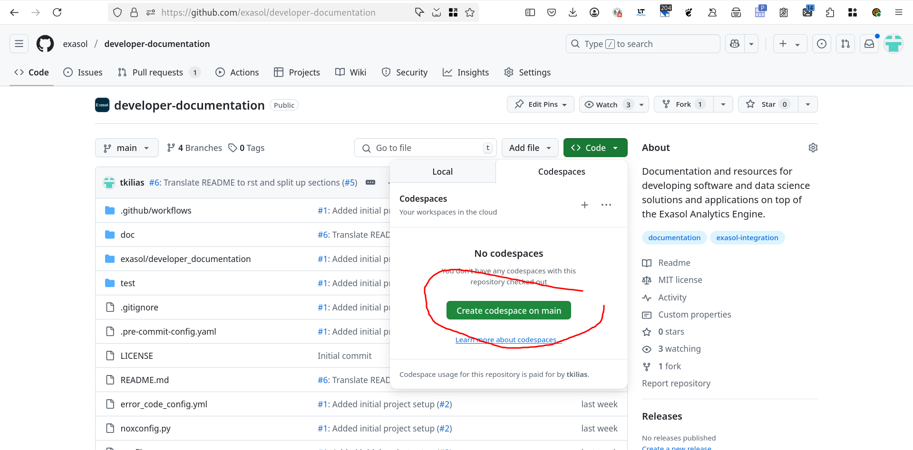
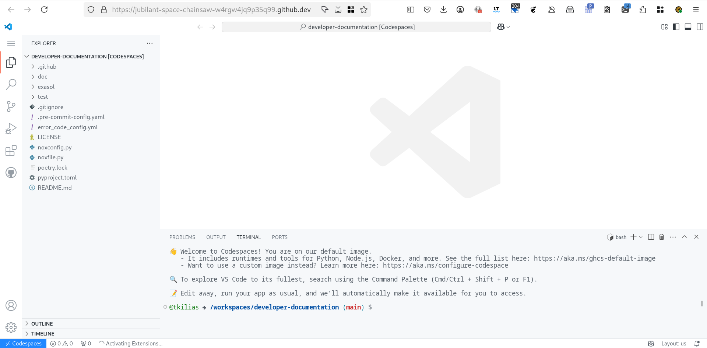
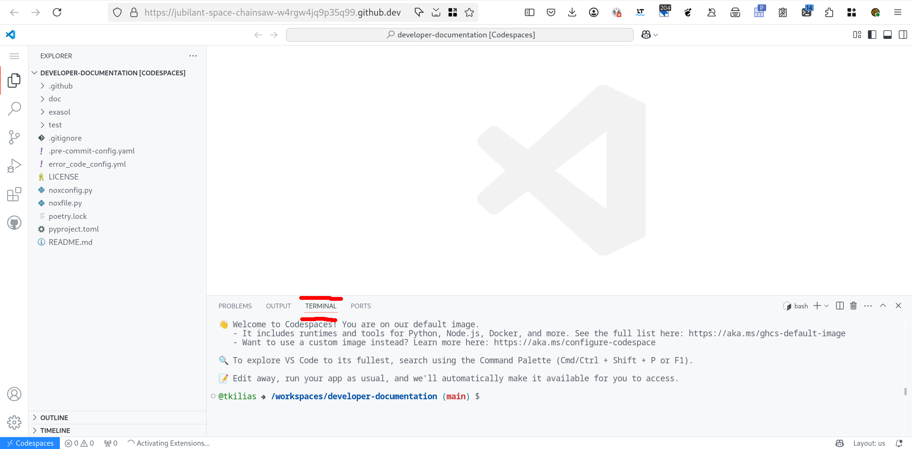
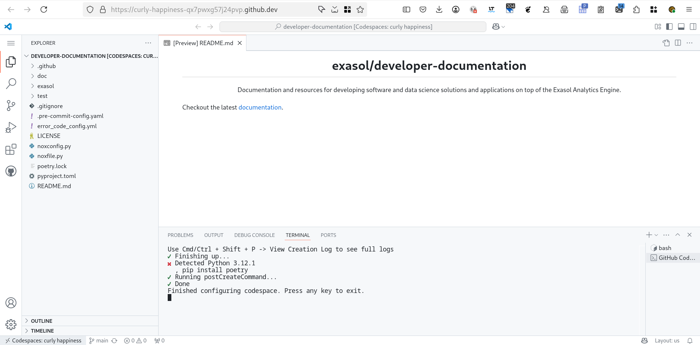
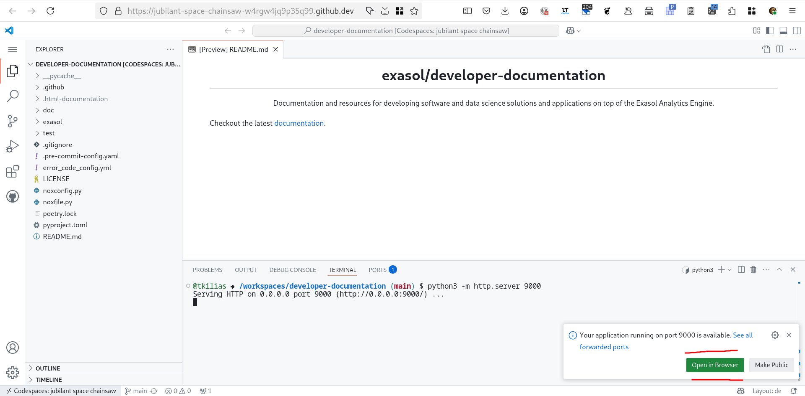
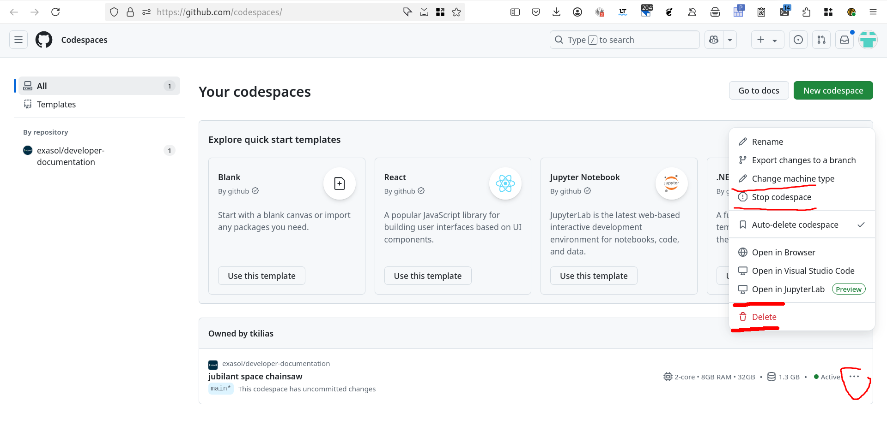

How to edit this Documentation
==============================

Edit locally
------------

Requirements
............

- Python >= 3.9
- `Poetry`_ >= 2.0

Preparations
............

1. Clone Repository:

.. code-block:: bash

    git clone https://github.com/exasol/developer-documentation.git

2. Create Branch:

.. code-block:: bash

    git switch -C documentation/my_awesome_branch

3. Create Poetry Environment:

.. code-block:: bash

    poetry install

Edit documentation
..................

1. Edit documentation in `doc` directory using `Sphinx reStructuredText`_

2. Build the Documentation locally:

.. code-block:: bash

    poetry run nox -s doc:builds

3. Open the locally built Documentation in your Browser:

.. code-block:: bash

    poetry run nox -s doc:open

4. When finished editing

.. code-block:: bash

    git commit -m "My awesome change"
    git push origin documentation/my_awesome_branch

And finally create a PR on GitHub.

Edit in GitHub Codespaces
-------------------------

Preparations
............

1. Start a Codespace on GitHub

2. Wait for Codespace to start (can take a few minutes)

3. Select the Terminal in Codespace, if not already selected

4. Wait for the installation of poetry

5. Create Branch:

.. code-block:: bash

    git switch -C documentation/my_awesome_branch

6. Create Poetry Environment:

.. code-block:: bash

    poetry install

Edit documentation
..................

4. Edit Documentation in `doc` directory using `Sphinx reStructuredText`_

5. Build the Documentation:

.. code-block:: bash

    poetry run nox -s doc:builds

6. Serve the Documentation:

.. code-block:: bash

    poetry run nox -s doc:serve &> /dev/null &

6. Forward port on Codespace and open the served Documentation:

7. When finished editing

.. code-block:: bash

    git commit -m "My awesome change"
    git push origin documentation/my_awesome_branch

And finally create a PR on GitHub.

Stopping or deleting a Codespace
................................

Codespace can cause costs, so stoping or deleting them after use is a good idea.

1. Go to the `Codespace page <https://github.com/codespaces/>`_

2. Stopping or deleting a Codespace

.. _Poetry: https://python-poetry.org/docs/#installing-with-pipx
.. _Sphinx reStructuredText: https://www.sphinx-doc.org/en/master/usage/restructuredtext/basics.html
